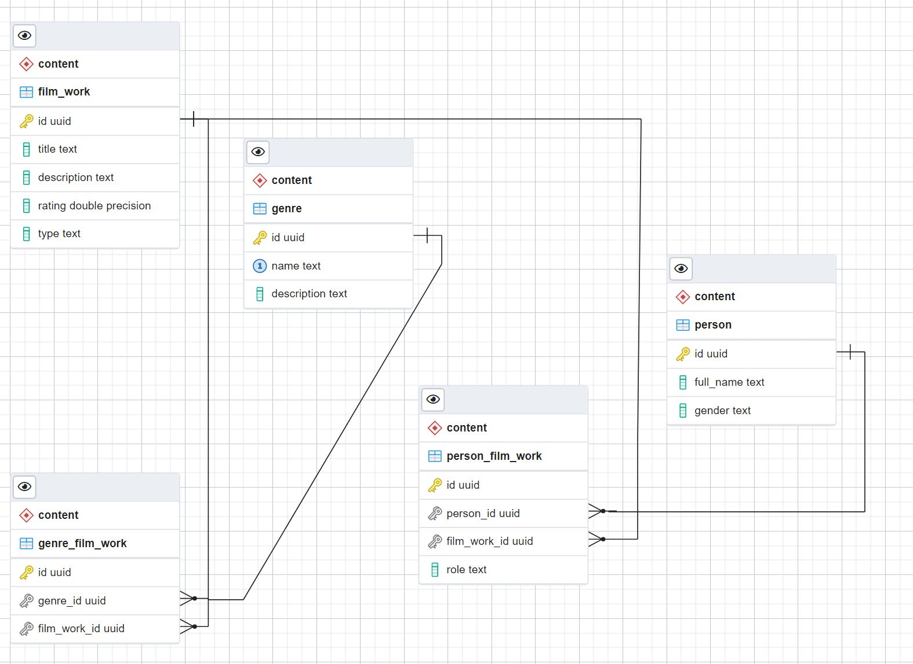

## Клиент для базы данных
**База данных**
Имеется база данных с информацией о фильмах (дамп в файле movies_db.sql), персонах и жанрах, схема данных:

**Клиент к бд**
Приложение содержит следующие вкладки:

 1. connect - подключение и отключение от бд, просмотр статуса подключения
 2. select - поиск по фильмам (выводится таблица, полученная с помощью соединения таблиц с фильмами, персонами и жанрами; чтобы найти инфо по фильму, необходимо, чтобы у него были жанры, т.е. чтобы фильм присутствовал в таблице genre_film_work)
 3. insert - содержит 5 вкладок: добавление фильма, жанра, персоны, жанра к фильму и персоны к фильму. 
 4. update - изменение информации о фильме (можно изменить описание и рейтинг)
 5. delete - удаление фильма, жанра, персоны, жанра из фильма и персоны из фильма
